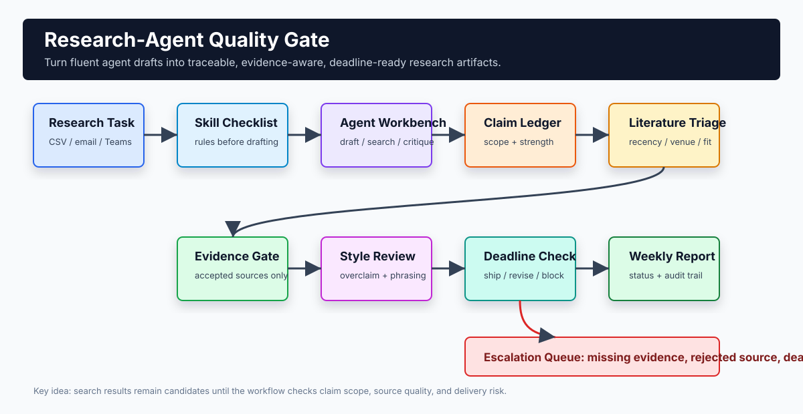
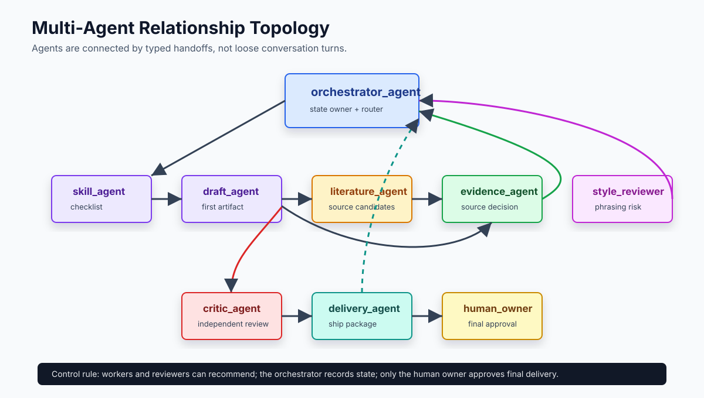
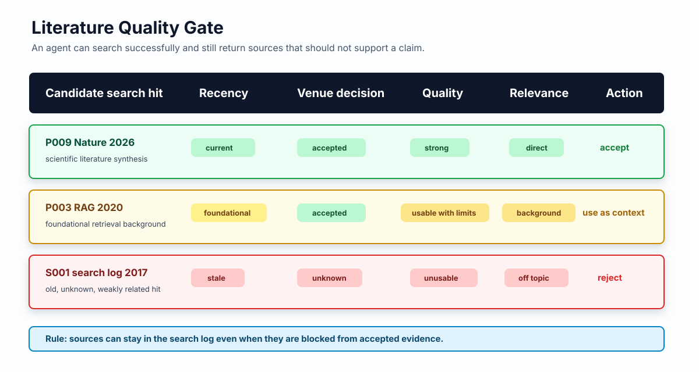
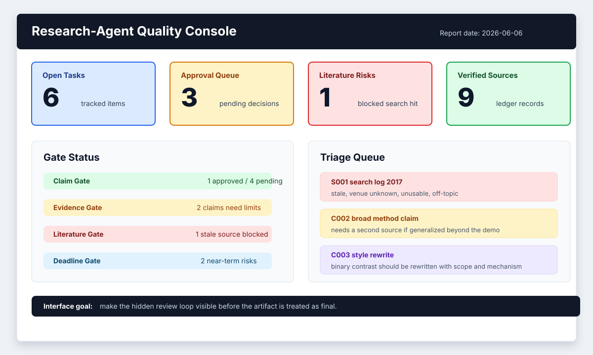
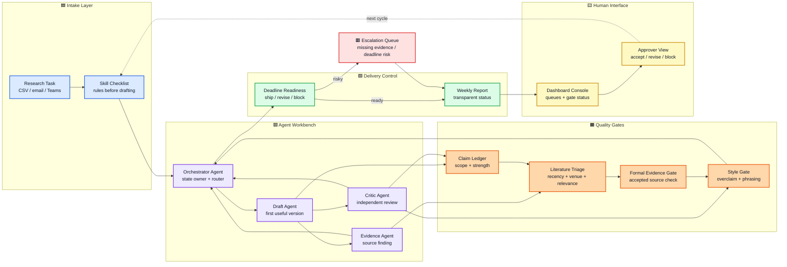

# Research-Agent Quality Gate 🚦

**Tired of AI agents that sound brilliant, cite vaguely, overclaim confidently, and still miss the actual research deliverable?**

You ask an agent for research help. It gives you something polished. Maybe even elegant. Then the real review starts:

- "Please do not overclaim."
- "Use formally published papers, not generic web memory."
- "You searched, but why are half the papers ancient, rejected, or only vaguely related?"
- "Do not write `not A but B`; qualify the contrast."
- "This sounds good, but what is the evidence?"
- "Why are three agents all polishing toward the same vibe?"
- "Which agent is responsible now, and who is allowed to approve the final output?"
- "The deadline is tomorrow. Stop exploring and ship the useful version."

This repository turns that repeated correction loop into a small, auditable workflow.

Agents can draft. Agents can search. Agents can critique.  
But before an output becomes a research claim, report section, or project decision, it must pass **claim**, **evidence**, **style**, **review**, and **deadline** gates.

> Pretty output is not the same as accepted research output.

## The Pain 🔥

LLM agents are fast, but research delivery has standards that fluency alone does not satisfy.

| Failure | What it feels like | Gate |
| --- | --- | --- |
| Expectation mismatch | The answer is fluent but ignores your actual research rules | Skill checklist |
| Overclaiming | A narrow observation becomes a broad method claim | Claim ledger |
| Weak evidence | The agent cites memory, vague sources, or unpublished material | Formal evidence gate |
| Literature noise | Search returns old, unaccepted, rejected, or weakly relevant papers | Literature quality gate |
| Rhetorical drift | The prose keeps using catchy but weak frames | Style rule checker |
| Multi-agent ambiguity | Agents talk, but ownership, handoffs, and delivery authority are unclear | Role registry + handoff ledger |
| Model-aesthetic convergence | Multiple agents agree because they share the same taste | Independent reviewer roles |
| Deadline blindness | The system keeps refining when you need a shippable artifact | Deadline readiness state |

The core move:

```text
agent draft -> typed handoff -> claim ledger -> literature triage -> evidence gate -> style gate -> delivery approval
```

## Why Skills Matter 🧠

Skills are not just longer prompts. In this project, a skill is a reusable operating procedure for expectations the base LLM does not reliably satisfy by default.

A good research-agent skill should encode rules like:

- Do not turn a narrow result into a general conclusion.
- Use formally published evidence for method claims.
- Treat literature search hits as candidates until recency, venue status, quality, and relevance are checked.
- Separate observation, inference, recommendation, and limitation.
- Preserve uncertainty when evidence is partial.
- Avoid binary contrast when a scoped mechanism claim is more accurate.
- Stop expanding the answer when the deadline requires a smaller truthful deliverable.

The point is to stop retyping the same corrections in every conversation.

## Example: The Sentence That Looks Good But Fails Review ✍️

Risky draft:

```text
This project is not a chatbot but a workflow control plane.
```

Why it gets flagged:

- It uses a VERY AI and boring and annoying structure `not A but B` 

Preferred rewrite:

```text
Although chatbot-style agents can produce useful drafts, research delivery also requires persistent task state, evidence checks, reviewer decisions, and deadline-aware acceptance criteria; this project therefore treats the agent as a contributor inside a workflow control layer.
```

Less punchy? Yes.  
More research-usable? Also yes.

## What This Demo Actually Runs ⚙️

The local demo uses CSV ledgers and Python scripts to simulate the gates.

```bash
python3 scripts/validate_task_fields.py
python3 scripts/generate_progress_report.py
```

Expected output:

```text
All task records passed validation.
Wrote .../reports/sample_weekly_report.md
```

The generated readiness report answers:

- Which claims are still provisional?
- Which claims need stronger evidence?
- Which phrases need rewriting?
- Which artifacts are risky near deadline?
- Which agent outputs require human review?
- Which formal sources support which claims?
- Which literature hits are stale, rejected, unverified, or off-topic?

## Visual Walkthrough 🖼️

End-to-end workflow:



Agent-to-agent relationships:



Literature search is treated as a candidate-generation step, not as automatic evidence:



The workflow should eventually sit behind a lightweight review console:



## Module Map 🌈



## Project Pieces 📦

| Layer | Purpose | File |
| --- | --- | --- |
| Task tracker | Owner, status, deadline, approval, and blocker state | `data/sample_research_tasks.csv` |
| Agent output log | Task-linked agent artifacts | `data/sample_agent_outputs.csv` |
| Claim ledger | Drafted claims vs. accepted claims | `data/sample_claim_ledger.csv` |
| Evidence ledger | Candidate sources, formal evidence, venue status, recency, quality, and relevance | `data/sample_evidence_ledger.csv` |
| Agent role registry | Agent responsibilities, permissions, required inputs, outputs, and approval boundary | `data/sample_agent_roles.csv` |
| Handoff ledger | Agent-to-agent transfer contracts, status, preconditions, and delivery impact | `data/sample_handoff_ledger.csv` |
| Validator | Schema, enums, joins, date checks, and style flags | `scripts/validate_task_fields.py` |
| Readiness report | Evidence, literature quality, rhetoric, deadline, and review queues | `scripts/generate_progress_report.py` |
| Design note | Quality-control workflow and acceptance criteria | `docs/quality_control_design.md` |
| Orchestration design | Multi-agent relationships, handoff contracts, and delivery authority | `docs/agent_orchestration_design.md` |
| Interface blueprint | Minimal dashboard/approval console for the workflow | `docs/interface_blueprint.md` |

## Data Model 🗂️

```text
task_id
  -> agent outputs
  -> handoff_id
      -> from_agent
      -> to_agent
      -> artifact_type
      -> acceptance_check
  -> claim_id
      -> evidence_id
      -> literature quality status
      -> phrasing status
      -> review status
      -> deadline readiness
```

Claims can be:

- `approved`: accepted for the intended use
- `pending`: still under review
- `needs_rewrite`: phrasing or claim scope is not acceptable
- `blocked`: required evidence, review, or input is missing

Evidence can be:

- `verified`: checked and suitable for the current claim
- `partial`: useful but not enough for a broad claim
- `missing`: required evidence has not been found
- `internal`: suitable only for a project-design claim

Literature candidates are tracked separately from accepted evidence:

- `source_age_status`: `current`, `foundational`, `dated`, `stale`, or `unknown`
- `venue_decision_status`: `accepted`, `preprint_only`, `rejected`, `unknown`, `official`, or `internal`
- `source_quality_status`: `strong`, `usable_with_limits`, `weak`, or `unusable`
- `relevance_status`: `direct`, `indirect`, `background`, `contradictory`, or `off_topic`

That distinction matters because an agent can search successfully and still return sources that should not support a claim.

## Multi-Agent Delivery Model 🤝

This project uses a conservative manager-style topology:

- `orchestrator_agent` owns workflow state and routes work.
- Worker agents produce bounded artifacts, such as checklists, drafts, and source candidate sets.
- Reviewer agents judge specific risks: evidence, style, and skeptical critique.
- `delivery_agent` packages what can ship by the deadline.
- `human_owner` is the only final approval boundary.

Every agent-to-agent transfer is recorded in `data/sample_handoff_ledger.csv`. A handoff must state the sender, receiver, artifact, precondition, acceptance check, status, and delivery impact. This keeps multi-agent interaction auditable instead of turning it into invisible chat history.

## What We Borrow From Current Multi-Agent Projects 🔭

The pattern is inspired by current orchestration projects, but narrowed for research delivery:

| Project pattern | What it does | What we use |
| --- | --- | --- |
| [OpenAI Agents SDK orchestration](https://openai.github.io/openai-agents-python/multi_agent/) | Distinguishes manager-style agents-as-tools from handoffs. | Manager keeps final state; specialists handle bounded subtasks. |
| [LangGraph handoffs](https://docs.langchain.com/oss/python/langchain/multi-agent/handoffs) | Uses stateful transitions and persistent state between agents. | Handoffs update explicit task state instead of relying on prompt memory. |
| [CrewAI collaboration](https://docs.crewai.com/en/concepts/collaboration) | Uses roles, delegation, sequential/hierarchical processes, and manager coordination. | Roles are explicit; specialists do not approve their own work. |
| [Microsoft Agent Framework workflows](https://learn.microsoft.com/en-us/agent-framework/workflows/) | Separates workflows from agents and supports type-safe orchestration, HITL, checkpointing, and multi-agent patterns. | Workflow owns business state; agents are components inside the process. |
| [Microsoft Agent Framework handoff UI demo](https://devblogs.microsoft.com/agent-framework/ag-ui-multi-agent-workflow-demo/) | Shows why users need visibility into active agent, waiting state, and approval pauses. | Interface shows gate status, handoff status, and approval queue. |

The point is not to copy a heavy framework. The point is to import the discipline: explicit topology, typed artifacts, visible state, and approval boundaries.

## Interface Direction 🖥️

Yes, a workflow like this should eventually have an interface.

The CSV + Python layer is the auditable backend. The user-facing version should expose a lightweight console:

- Intake form: task, due date, expected output, source candidates, and approval owner.
- Gate dashboard: claim, literature, evidence, style, review, and deadline status.
- Literature triage queue: stale, unaccepted, rejected, weak, or off-topic search hits.
- Approver view: accept, request rewrite, downgrade claim strength, or block.
- Report view: weekly status, evidence ledger, risks, and deferred work.

## Literature Quality Gate 🧪

Older papers are not automatically bad. Some older papers are foundational, so they are useful for explaining the background of a technique. The problem starts when a system uses an old or weakly related source as if it were current direct evidence for a new claim.

This demo therefore asks four questions before a search hit becomes evidence:

| Question | Example status |
| --- | --- |
| Is it recent enough for the claim? | `current`, `foundational`, `stale` |
| Was it formally accepted? | `accepted`, `preprint_only`, `rejected`, `unknown` |
| Is the source quality strong enough? | `strong`, `usable_with_limits`, `unusable` |
| Does it actually support this claim? | `direct`, `background`, `off_topic` |

The gate can preserve a foundational paper while blocking a stale, rejected, or irrelevant search hit.

## Research Anchors 📚

This demo uses older papers only when they are foundational, and newer papers when the claim is about current agent and literature-quality behavior.

Foundation anchors:

- [ReAct, ICLR 2023](https://openreview.net/forum?id=WE_vluYUL-X): reasoning plus external actions.
- [Toolformer, NeurIPS 2023](https://proceedings.neurips.cc/paper/2023/hash/d842425e4bf79ba039352da0f658a906-Abstract-Conference.html): tool use as a capability extension for language models.
- [Retrieval-Augmented Generation, NeurIPS 2020](https://proceedings.neurips.cc/paper/2020/hash/6b493230205f780e1bc26945df7481e5-Abstract.html): foundational retrieval-augmented generation pattern; useful background, not direct evidence for current agent reliability.

Recent quality-control anchors:

- [Do Language Models Know When They’re Hallucinating References?, Findings of EACL 2024](https://aclanthology.org/2024.findings-eacl.62/): reference hallucination as a concrete literature-quality failure mode.
- [AgentBench, ICLR 2024](https://proceedings.iclr.cc/paper_files/paper/2024/hash/e9df36b21ff4ee211a8b71ee8b7e9f57-Abstract-Conference.html): long-term reasoning, decision-making, and instruction following remain obstacles for usable agents.
- [FIRE, Findings of NAACL 2025](https://aclanthology.org/2025.findings-naacl.158/): iterative retrieval and verification for fact-checking atomic claims.
- [MAMM-Refine, NAACL 2025](https://aclanthology.org/2025.naacl-long.498/): multi-agent/multi-model refinement for improving faithfulness in long-form generation.
- [Query-driven Scientific Evidence Extraction, ACL 2025](https://aclanthology.org/2025.acl-long.1359/): evidence extraction from scientific studies remains a difficult structured task, especially with conflicting evidence.
- [OpenScholar, Nature 2026](https://www.nature.com/articles/s41586-025-10072-4): recent retrieval-augmented scientific literature synthesis with citation-backed answers and explicit citation-accuracy evaluation.

## What This Is Not 🧯

This is not a claim that one workflow solves agent reliability.

The narrower claim is that repeated research expectations can be made operational by tracking:

- claims
- evidence
- style issues
- reviewer decisions
- deadline state

In other words: make the hidden review loop visible.

## Roadmap 🛠️

- Add tests for claim/evidence validation rules.
- Add CLI arguments for custom input and output paths.
- Add a small style-rule module for overclaim and rhetorical-pattern detection.
- Add a SharePoint or Excel schema for the M365 version.
- Add a Power Automate flow export for intake, approval, reminders, and escalation.
- Add a reviewer-rotation log so critique roles cannot approve their own drafts.
- Add acceptance-status fields for `accepted`, `accepted_with_limits`, `partial`, `needs_revision`, `blocked`, and `rejected`.
