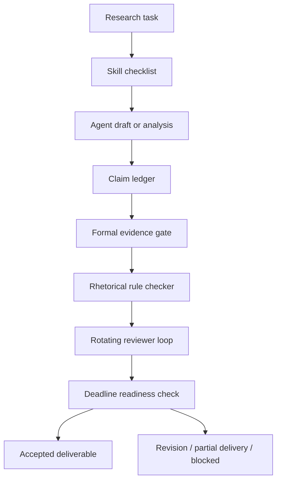

# Research-Agent Quality Gate 🚦

**Tired of AI agents that sound brilliant, cite vaguely, overclaim confidently, and still miss the actual research deliverable?**

You ask an agent for research help. It gives you something polished. Maybe even elegant. Then the real review starts:

- "Please do not overclaim."
- "Use formally published papers, not generic web memory."
- "Do not write `not A but B`; qualify the contrast."
- "This sounds good, but what is the evidence?"
- "Why are three agents all polishing toward the same vibe?"
- "The deadline is tomorrow. Stop exploring and ship the useful version."

This repository turns that repeated correction loop into a small, auditable workflow.

Agents can draft. Agents can search. Agents can critique.  
But before an output becomes a research claim, report section, or project decision, it must pass **claim**, **evidence**, **style**, **review**, and **deadline** gates.

> Pretty output is not the same as accepted research output.

## The Pain 🔥

LLM agents are fast, but research delivery has standards that fluency alone does not satisfy.

| Failure | What it feels like | Gate |
| --- | --- | --- |
| Expectation mismatch | The answer is fluent but ignores your actual research rules | Skill checklist |
| Overclaiming | A narrow observation becomes a broad method claim | Claim ledger |
| Weak evidence | The agent cites memory, vague sources, or unpublished material | Formal evidence gate |
| Rhetorical drift | The prose keeps using catchy but weak frames | Style rule checker |
| Model-aesthetic convergence | Multiple agents agree because they share the same taste | Rotating reviewer roles |
| Deadline blindness | The system keeps refining when you need a shippable artifact | Deadline readiness state |

The core move:

```text
agent draft -> claim ledger -> evidence gate -> style gate -> reviewer loop -> deadline-ready artifact
```

## Why Skills Matter 🧠

Skills are not just longer prompts. In this project, a skill is a reusable operating procedure for expectations the base LLM does not reliably satisfy by default.

A good research-agent skill should encode rules like:

- Do not turn a narrow result into a general conclusion.
- Use formally published evidence for method claims.
- Separate observation, inference, recommendation, and limitation.
- Preserve uncertainty when evidence is partial.
- Avoid binary contrast when a scoped mechanism claim is more accurate.
- Stop expanding the answer when the deadline requires a smaller truthful deliverable.

The point is to stop retyping the same corrections in every conversation.

## Example: The Sentence That Looks Good But Fails Review ✍️

Risky draft:

```text
This project is not a chatbot but a workflow control plane.
```

Why it gets flagged:

- It uses a catchy binary contrast.
- It hides the actual mechanism.
- It sounds stronger than the current evidence needs.

Preferred rewrite:

```text
Although chatbot-style agents can produce useful drafts, research delivery also requires persistent task state, evidence checks, reviewer decisions, and deadline-aware acceptance criteria; this project therefore treats the agent as a contributor inside a workflow control layer.
```

Less punchy? Yes.  
More research-usable? Also yes.

## What This Demo Actually Runs ⚙️

The local demo uses CSV ledgers and Python scripts to simulate the gates.

```bash
python3 scripts/validate_task_fields.py
python3 scripts/generate_progress_report.py
```

Expected output:

```text
All task records passed validation.
Wrote .../reports/sample_weekly_report.md
```

The generated readiness report answers:

- Which claims are still provisional?
- Which claims need stronger evidence?
- Which phrases need rewriting?
- Which artifacts are risky near deadline?
- Which agent outputs require human review?
- Which formal sources support which claims?

## Workflow 🧩



## Project Pieces 📦

| Layer | Purpose | File |
| --- | --- | --- |
| Task tracker | Owner, status, deadline, approval, and blocker state | `data/sample_research_tasks.csv` |
| Agent output log | Task-linked agent artifacts | `data/sample_agent_outputs.csv` |
| Claim ledger | Drafted claims vs. accepted claims | `data/sample_claim_ledger.csv` |
| Evidence ledger | Formal sources and project evidence | `data/sample_evidence_ledger.csv` |
| Validator | Schema, enums, joins, date checks, and style flags | `scripts/validate_task_fields.py` |
| Readiness report | Evidence, rhetoric, deadline, and review queues | `scripts/generate_progress_report.py` |
| Design note | Quality-control workflow and acceptance criteria | `docs/quality_control_design.md` |

## Data Model 🗂️

```text
task_id
  -> agent outputs
  -> claim_id
      -> evidence_id
      -> phrasing status
      -> review status
      -> deadline readiness
```

Claims can be:

- `approved`: accepted for the intended use
- `pending`: still under review
- `needs_rewrite`: phrasing or claim scope is not acceptable
- `blocked`: required evidence, review, or input is missing

Evidence can be:

- `verified`: checked and suitable for the current claim
- `partial`: useful but not enough for a broad claim
- `missing`: required evidence has not been found
- `internal`: suitable only for a project-design claim

## Research Anchors 📚

This demo borrows patterns from published work on tool use, retrieval, hallucination checks, feedback loops, and agent evaluation:

- [ReAct, ICLR 2023](https://openreview.net/forum?id=WE_vluYUL-X): reasoning plus external actions.
- [Toolformer, NeurIPS 2023](https://proceedings.neurips.cc/paper/2023/hash/d842425e4bf79ba039352da0f658a906-Abstract-Conference.html): tool use as a capability extension for language models.
- [Retrieval-Augmented Generation, NeurIPS 2020](https://proceedings.neurips.cc/paper/2020/hash/6b493230205f780e1bc26945df7481e5-Abstract.html): grounding generation in retrieved knowledge.
- [SelfCheckGPT, EMNLP 2023](https://aclanthology.org/2023.emnlp-main.557/): black-box hallucination detection through consistency checks.
- [Reflexion, NeurIPS 2023](https://papers.neurips.cc/paper_files/paper/2023/hash/1b44b878bb782e6954cd888628510e90-Abstract-Conference.html): verbal feedback memory for repeated agent attempts.
- [Self-Refine, NeurIPS 2023](https://proceedings.neurips.cc/paper_files/paper/2023/hash/91edff07232fb1b55a505a9e9f6c0ff3-Abstract-Conference.html): iterative feedback and revision.
- [AgentBench, ICLR 2024](https://proceedings.iclr.cc/paper_files/paper/2024/hash/e9df36b21ff4ee211a8b71ee8b7e9f57-Abstract-Conference.html): long-term reasoning, decision-making, and instruction following remain obstacles for usable agents.

## What This Is Not 🧯

This is not a claim that one workflow solves agent reliability.

The narrower claim is that repeated research expectations can be made operational by tracking:

- claims
- evidence
- style issues
- reviewer decisions
- deadline state

In other words: make the hidden review loop visible.

## Roadmap 🛠️

- Add tests for claim/evidence validation rules.
- Add CLI arguments for custom input and output paths.
- Add a small style-rule module for overclaim and rhetorical-pattern detection.
- Add a SharePoint or Excel schema for the M365 version.
- Add a Power Automate flow export for intake, approval, reminders, and escalation.
- Add a reviewer-rotation log so critique roles cannot approve their own drafts.
- Add acceptance-status fields for `accepted`, `accepted_with_limits`, `partial`, `needs_revision`, `blocked`, and `rejected`.

