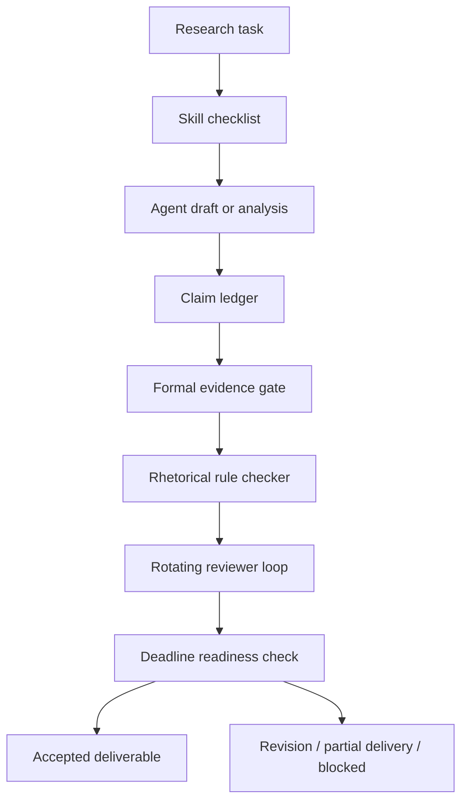

# Research-Agent Quality Control Workflow

**A deadline-aware quality gate for LLM-generated research artifacts.**

LLM agents can draft quickly, search broadly, and make rough progress across many research tasks. The failure mode is subtler: the output often looks finished before it is actually acceptable. It may overclaim, rely on weak or unpublished evidence, repeat a rhetorically attractive sentence pattern, drift toward the model's preferred style, or keep iterating past the point where a deadline-ready artifact is needed.

This project prototypes a small control workflow for that problem. Agents produce drafts and intermediate artifacts; the workflow checks whether those artifacts satisfy research expectations before they become accepted claims, report sections, or project decisions.

## Core Problem

The project is built around six recurring failures in agent-assisted research work:

| Failure | What it looks like | Control mechanism |
| --- | --- | --- |
| Expectation mismatch | The answer is fluent but ignores local research rules | Skill checklist |
| Overclaiming | The statement is stronger than the evidence | Claim ledger |
| Weak evidence | The claim cites memory, generic web text, or an unpublished source | Formal evidence gate |
| Rhetorical pattern drift | The agent repeats attractive but weak frames such as binary contrast | Style rule checker |
| Model-aesthetic convergence | Multiple agents polish toward the same taste instead of challenging assumptions | Rotating reviewer roles |
| Deadline blindness | The system keeps improving prose instead of shipping a usable artifact | Deadline-ready delivery state |

The key idea:

> A polished agent output is provisional until it passes claim, evidence, style, review, and deadline gates.

## Why Skills Exist Here

Skills are not decorative prompts. In this project, a skill is a reusable operating procedure for a task family whose requirements the base LLM does not reliably satisfy by default.

Examples:

- Do not turn a narrow observation into a general method claim.
- Use formally published sources for method claims.
- Separate observation, inference, recommendation, and limitation.
- Preserve uncertainty when evidence is partial.
- Avoid a binary "not A but B" frame when the stronger research form is a scoped contrast.
- Stop expanding the answer when the deadline requires a smaller truthful deliverable.

The workflow converts those expectations into checks that can be repeated every time, instead of rediscovering the same corrections in every conversation.

## Example Style Gate

Risky draft:

```text
This project is not a chatbot but a workflow control plane.
```

Preferred research-style rewrite:

```text
Although chatbot-style agents can produce useful drafts, research delivery also requires persistent task state, evidence checks, reviewer decisions, and deadline-aware acceptance criteria; this project therefore treats the agent as a contributor inside a workflow control layer.
```

The rewrite is longer, but it is more useful: it explains why the tempting claim exists, what additional mechanism changes the conclusion, and what scope the final claim has.

## Workflow



## Runnable Demo

The local demo uses CSV ledgers and Python scripts to simulate the workflow.

```bash
python3 scripts/validate_task_fields.py
python3 scripts/generate_progress_report.py
```

Expected output:

```text
All task records passed validation.
Wrote .../reports/sample_weekly_report.md
```

The generated readiness report answers:

- Which tasks are close to deadline?
- Which claims are still provisional?
- Which claims have partial or missing evidence?
- Which sentences need rhetorical rewriting?
- Which agent outputs require human review?
- Which claims are supported by verified formal sources?

## Implemented Artifacts

| Layer | Purpose | File |
| --- | --- | --- |
| Task tracker | Tracks owner, status, deadline, approval, and blocker state | `data/sample_research_tasks.csv` |
| Agent output log | Stores agent outputs as task-linked artifacts | `data/sample_agent_outputs.csv` |
| Claim ledger | Separates drafted claims from accepted claims | `data/sample_claim_ledger.csv` |
| Evidence ledger | Links claims to formally published sources or project evidence | `data/sample_evidence_ledger.csv` |
| Structural validation | Checks schema, enums, task joins, claim joins, dates, and style flags | `scripts/validate_task_fields.py` |
| Readiness report | Produces evidence, rhetoric, deadline, and review queues | `scripts/generate_progress_report.py` |
| Design note | Specifies quality-control workflow and acceptance criteria | `docs/quality_control_design.md` |

## Data Model

The task tracker records workflow state. The claim ledger records what the agent wants to say. The evidence ledger records what is allowed to support that claim.

```text
task_id
  -> agent outputs
  -> claim_id
      -> evidence_id
      -> phrasing status
      -> review status
      -> deadline readiness
```

Claims can be:

- `approved`: accepted for the intended use
- `pending`: still under review
- `needs_rewrite`: phrasing or claim scope is not acceptable
- `blocked`: required evidence, review, or input is missing

Evidence can be:

- `verified`: checked and suitable for the current claim
- `partial`: useful but not enough for a broad claim
- `missing`: required evidence has not been found
- `internal`: suitable only for a project-design claim

## Research Anchors

This demo borrows patterns from formally published work on tool use, agent feedback, retrieval, hallucination checks, and agent evaluation:

- [ReAct, ICLR 2023](https://openreview.net/forum?id=WE_vluYUL-X): interleaves reasoning traces and task-specific actions so models can use external information.
- [Toolformer, NeurIPS 2023](https://proceedings.neurips.cc/paper/2023/hash/d842425e4bf79ba039352da0f658a906-Abstract-Conference.html): motivates tool use as a way to extend a language model beyond pure next-token generation.
- [Retrieval-Augmented Generation, NeurIPS 2020](https://proceedings.neurips.cc/paper/2020/hash/6b493230205f780e1bc26945df7481e5-Abstract.html): grounds generation in retrieved non-parametric memory for knowledge-intensive tasks.
- [SelfCheckGPT, EMNLP 2023](https://aclanthology.org/2023.emnlp-main.557/): frames hallucination detection as a black-box consistency-checking problem.
- [Reflexion, NeurIPS 2023](https://papers.neurips.cc/paper_files/paper/2023/hash/1b44b878bb782e6954cd888628510e90-Abstract-Conference.html): uses verbal feedback memory to improve repeated agent attempts.
- [Self-Refine, NeurIPS 2023](https://proceedings.neurips.cc/paper_files/paper/2023/hash/91edff07232fb1b55a505a9e9f6c0ff3-Abstract-Conference.html): shows iterative feedback and revision, while this project adds explicit stopping and acceptance gates.
- [AgentBench, ICLR 2024](https://proceedings.iclr.cc/paper_files/paper/2024/hash/e9df36b21ff4ee211a8b71ee8b7e9f57-Abstract-Conference.html): reports that long-term reasoning, decision-making, and instruction following remain obstacles for usable LLM agents.

## What This Is Not

This is not an attempt to prove that one workflow solves agent reliability. The claim is narrower: repeated research expectations can be made operational by tracking claims, evidence, style issues, reviewer decisions, and deadline state as explicit workflow objects.

## Roadmap

- Add tests for claim/evidence validation rules.
- Add CLI arguments for custom input and output paths.
- Add a small style-rule module for overclaim and rhetorical-pattern detection.
- Add a SharePoint or Excel schema for the M365 version.
- Add a Power Automate flow export for intake, approval, reminders, and escalation.
- Add a reviewer-rotation log so critique roles cannot approve their own drafts.
- Add acceptance-status fields for `accepted`, `accepted_with_limits`, `partial`, `needs_revision`, `blocked`, and `rejected`.

