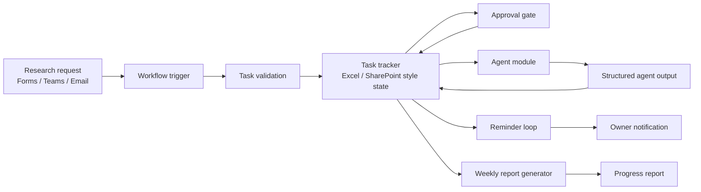

# Research Process Automation Demo

**A lightweight ResearchOps control plane for coordinating humans, AI agents, approvals, deadlines, and progress reports.**

Research work rarely fails because nobody can write another summary. It fails because the next action is buried in a Teams message, an approval sits in someone's inbox, an Excel tracker is stale, or an agent produced a useful note that never became accountable project state.

This repository prototypes a small workflow system for that gap: AI agents can analyze and summarize, while an orchestration layer keeps time, ownership, approval state, reminders, and reporting grounded in a shared task record.

## Project Thesis

Multi-agent systems are good at producing intermediate artifacts. They are less reliable as process owners unless the workflow around them provides:

- Durable state
- Explicit ownership
- Human approval gates
- Deadline and reminder logic
- Audit-friendly reporting
- A controlled handoff between agent output and project status

The core idea is simple:

> Agents should produce bounded work products. The workflow layer should decide what happens next.

## Scenario

A research team coordinates several workstreams through email, Teams, Excel trackers, meeting notes, and agent-generated summaries. A task may need data validation, supervisor approval, a literature summary, a weekly report entry, or a reminder before a deadline.

In the current process, those actions are loosely connected. The tracker may not reflect what the agent found. The supervisor may not know which claim needs approval. The owner may not get a reminder until the deadline is already missed.

This demo turns that scattered coordination pattern into a structured flow:



## What This Demo Implements

The current implementation is intentionally small, but it models the pieces that matter in a real process automation system.

| Layer | Responsibility | Demo artifact |
| --- | --- | --- |
| Intake | Represent incoming research tasks as structured records | `data/sample_research_tasks.csv` |
| Validation | Check required fields and approval consistency | `scripts/validate_task_fields.py` |
| Agent output boundary | Store agent results as task-linked artifacts, not hidden state | `data/sample_agent_outputs.csv` |
| Approval queue | Separate execution status from approval status | `power-automate/approval_workflow.md` |
| Reminder loop | Flag open tasks close to due date | `scripts/generate_progress_report.py` |
| Reporting loop | Generate a reproducible weekly status report | `reports/sample_weekly_report.md` |
| Architecture | Explain the workflow split between M365, Python, and agents | `docs/solution_architecture.md` |

## Scope

This repository has two layers:

- **Runnable local core:** CSV-based task state, validation checks, agent-output joins, reminder eligibility, approval queue extraction, and Markdown report generation.
- **M365 deployment blueprint:** documented Power Automate flows for intake, approval routing, reminders, tracker updates, and report distribution.

The Power Automate pieces are written as implementation notes rather than exported flow packages. The local Python core is the executable slice that simulates the same control logic against sample task records.

## Pain Points

The demo is built around four recurring failure modes in research coordination.

### 1. State Is Scattered

Tasks arrive through messages, files, and conversations. If the system of record is not updated, nobody knows whether a task is open, blocked, approved, or ready for reporting.

### 2. Agents Lack Process Memory

An agent can summarize the latest notes, but that does not mean it owns the deadline, approval path, escalation rule, or audit trail. A good summary is not the same as durable workflow state.

### 3. Approvals Are Too Informal

Research reports often contain claims that should be reviewed before they are shared. If approval is just another message thread, pending approvals become invisible.

### 4. Reporting Is Reconstructed By Hand

Weekly reports are often rebuilt from memory, chat history, or partial tracker updates. That makes them slow to produce and hard to verify.

## Design Approach

This project separates the workflow into three roles.

### Workflow Layer

The workflow layer owns time, routing, approvals, reminders, and updates to the tracker. In a Microsoft 365 setting, this would map naturally to Power Automate flows connected to Forms, Teams, Outlook, Excel, and SharePoint.

### Deterministic Python Layer

Python handles logic that should be reproducible and testable:

- Required field validation
- Approval consistency checks
- Date parsing
- Reminder eligibility
- Status aggregation
- Markdown report generation

### Agent Layer

Agent modules are useful where language understanding helps:

- Summarizing research updates
- Extracting blockers from notes
- Drafting report sections
- Suggesting next actions
- Flagging outputs that need human review

Agent outputs are written back as structured records. They do not directly approve themselves, close tasks, or suppress reminders.

## Related System Patterns

The design borrows ideas from workflow and agent systems without copying any one framework.

- **[Power Automate approvals](https://learn.microsoft.com/en-us/power-automate/modern-approvals):** process approval flows can start from a trigger, send approval requests, notify requesters, and update a SharePoint-style record after a decision.
- **[n8n workflows](https://docs.n8n.io/integrations/builtin/node-types/):** trigger nodes start workflows, action nodes perform steps, and sub-workflow triggers support modular automation.
- **[LangGraph interrupts and checkpoints](https://github.com/langchain-ai/langgraph/blob/main/libs/langgraph/langgraph/types.py):** human-in-the-loop workflows rely on persisted state so execution can pause, receive human input, and resume with context.
- **[AutoGen group chat](https://microsoft.github.io/autogen/stable/user-guide/core-user-guide/design-patterns/group-chat.html):** multi-agent coordination often needs a manager that selects the next participant and keeps the conversation from becoming unstructured.

This project translates those patterns into a research-process setting: the tracker is the state, approvals are explicit gates, reminders are scheduled checks, and agents are bounded contributors.

## Repository Map

```text
research-process-automation-demo/
  README.md
  docs/
    problem_statement.md
    as_is_process.md
    to_be_process.md
    agent_orchestration_design.md
    automation_opportunities.md
    solution_architecture.md
  data/
    sample_research_tasks.csv
    sample_agent_outputs.csv
  scripts/
    validate_task_fields.py
    generate_progress_report.py
  reports/
    sample_weekly_report.md
  power-automate/
    flow_description.md
    approval_workflow.md
    reminder_workflow.md
```

## Run The Demo

From the repository root:

```bash
python3 scripts/validate_task_fields.py
python3 scripts/generate_progress_report.py
```

Expected output:

```text
All task records passed validation.
Wrote .../reports/sample_weekly_report.md
```

The generated report summarizes:

- Task counts by status
- Task counts by owner
- Pending approvals
- Deadline reminders
- Agent outputs waiting for human review
- Recorded blockers

## Data Contract

The task tracker is the system of record.

| Field | Purpose |
| --- | --- |
| `task_id` | Stable identifier across tasks, agent outputs, approvals, and reports |
| `project_name` | Research workstream |
| `task_title` | Human-readable task |
| `owner` | Responsible person |
| `due_date` | Reminder and reporting date |
| `status` | Execution state, such as `not_started`, `in_progress`, or `done` |
| `approval_needed` | Whether the task needs supervisor approval |
| `approval_status` | Approval state, such as `pending`, `approved`, or `not_required` |
| `priority` | Escalation signal |
| `blocker` | Open issue preventing progress |

Agent outputs are stored separately and joined through `task_id`.

| Field | Purpose |
| --- | --- |
| `task_id` | Links the agent output back to a task record |
| `agent_name` | Agent or module that produced the output |
| `output_type` | Kind of output, such as `weekly_summary` or `quality_check` |
| `summary` | Short human-readable artifact summary |
| `needs_human_review` | Whether the output should enter the review queue |

The validation script currently checks required task fields, ISO date format, allowed status values, approval consistency, priority values, duplicate task IDs, and whether agent outputs reference known tasks.

## What A Production Version Would Add

- SharePoint or Dataverse as the durable task store
- Power Automate intake flow from Forms, Teams, and Outlook
- Approval timeout and escalation rules
- Reminder cooldown fields such as `last_reminder_at` and `reminder_count`
- Agent review fields such as `needs_human_review` and `agent_review_status`
- Workflow run metadata such as `workflow_run_id`, `created_at`, and `updated_at`
- A dashboard over owner, approval, status, and blocker trends
- Tests for validation rules and report generation

## Why This Shape

The point is not to build another chatbot for research management. The point is to make research coordination observable.

When a task moves, the tracker changes.  
When an approval is needed, the approval state is visible.  
When a deadline approaches, the reminder is rule-based.  
When an agent contributes, its output is attached to a task.  
When a report is generated, it is reproducible from structured state.

That is the difference between an agent that can help and a process that can keep moving.
