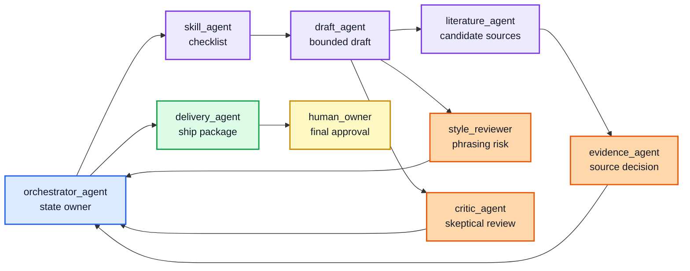

# Multi-Agent Interaction and Delivery Design

This project now treats multi-agent work as an orchestration problem, not as a group chat problem. The important design question is not how many agents exist. It is how responsibilities, handoffs, review rights, and delivery decisions are controlled.

## What Current Frameworks Suggest

Recent agent frameworks tend to separate four patterns:

| Pattern | How other projects use it | Useful lesson for this demo |
| --- | --- | --- |
| Manager / agents-as-tools | A central agent keeps control and calls specialists for bounded subtasks. | Use when one workflow owner must preserve state and final responsibility. |
| Handoff | One agent transfers control to another specialist when the next stage belongs elsewhere. | Use only when the receiver truly owns the next stage and the handoff reason is logged. |
| Sequential / concurrent workflow | Agents run in a fixed order or in parallel when subtasks are independent. | Use deterministic order for gates; use parallel work only for independent checks. |
| Group chat / magentic manager | A manager dynamically decides which specialist acts next for open-ended tasks. | Useful for exploration, but risky for deadline-bound delivery unless bounded by acceptance criteria. |

The design choice here is conservative: a manager-style orchestrator owns state, while specialist agents produce typed artifacts. Handoffs are recorded as workflow events rather than hidden conversation turns.

## Agent Relationship Model

The orchestrator does not rewrite every artifact. It keeps the project state, decides the next gate, and prevents local agent outputs from becoming final decisions by accident.

## Roles and Boundaries

| Agent | Role | May approve own output? | Output |
| --- | --- | --- | --- |
| `orchestrator_agent` | State owner and router | No | `delivery_decision` |
| `skill_agent` | Converts repeated expectations into a checklist | No | `skill_checklist` |
| `draft_agent` | Produces the first bounded artifact | No | `draft_artifact` |
| `literature_agent` | Searches and labels candidate sources | No | `literature_candidate_set` |
| `evidence_agent` | Decides whether sources can support claims | No | `evidence_decision` |
| `style_reviewer` | Flags rhetorical and overclaim risks | No | `style_review` |
| `critic_agent` | Performs skeptical review | No | `critique_record` |
| `delivery_agent` | Freezes what can ship by the deadline | No | `delivery_package` |
| `human_owner` | Final acceptance authority | Yes | `approval_decision` |

The registry lives in `data/sample_agent_roles.csv`.

## Handoff Contract

Every handoff must include:

| Field | Purpose |
| --- | --- |
| `handoff_id` | Stable audit identifier. |
| `task_id` | Task being moved through the workflow. |
| `from_agent` / `to_agent` | Sender and receiver. Both must exist in the role registry. |
| `handoff_type` | `manager_call`, `sequential`, `peer_review`, `return_to_manager`, or `human_approval`. |
| `artifact_id` | Claim, task, or package being handed off. |
| `artifact_type` | The concrete object being transferred. |
| `precondition` | What must be true before the receiver acts. |
| `acceptance_check` | How the receiver knows the handoff is complete. |
| `status` | `accepted`, `pending`, `needs_revision`, `blocked`, or `rejected`. |
| `delivery_impact` | How this handoff affects shipping. |

The handoff ledger lives in `data/sample_handoff_ledger.csv`.

## Delivery State

The delivery agent receives a gate summary rather than a raw conversation. Its job is to produce one of these outcomes:

| Outcome | Meaning |
| --- | --- |
| `accepted` | All required gates passed and the human owner approved final delivery. |
| `accepted_with_limits` | The artifact can ship, but limitations must remain visible. |
| `partial` | A smaller truthful deliverable is shipped by deadline. |
| `needs_revision` | The artifact is not ready, but the issue is resolvable. |
| `blocked` | Required evidence, review, input, or approval is missing. |
| `rejected` | The artifact should not be used for the intended decision. |

The key delivery rule is that a reviewer can recommend, but only the human owner can approve a final delivery package.

## Controls Added by This Demo

- Role registry: makes agent responsibilities explicit.
- Handoff ledger: records agent-to-agent transfer instead of hiding it in chat history.
- Approval boundary: prevents draft, evidence, style, or critic agents from approving their own outputs.
- Delivery gate: keeps deadline decisions separate from rhetorical polish.
- Report trail: exposes open handoffs and delivery-blocking issues in `reports/sample_weekly_report.md`.

This keeps the multi-agent system closer to a workflow than a debate. Agents can contribute, but the workflow decides what their contribution means.
