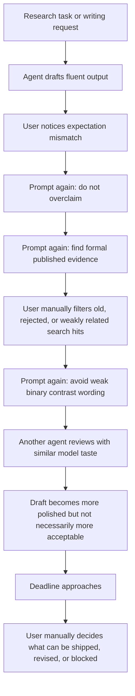

# As-Is Process

The current process depends on repeated prompting and ad hoc review. Agents can draft quickly, but the review criteria live in the user's memory rather than in the workflow.

## Pain Points

- The agent treats fluency as a proxy for readiness.
- Evidence quality is not tracked claim by claim.
- Search results are not separated from accepted evidence.
- Old, unaccepted, rejected, unknown, or off-topic literature can slip into a draft.
- Repeated writing rules are retyped instead of encoded as skills.
- Multi-agent review can converge on the same aesthetic rather than independent critique.
- Deadline pressure is invisible to the agent unless restated in the prompt.
- The final artifact may be large and polished but still unsuitable for the actual research decision.
