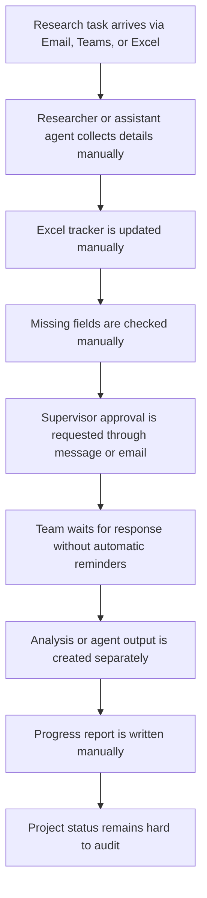

# As-Is Process

The current process depends on manual coordination and ad hoc agent support.

## Pain Points

- Tasks arrive through different channels and are easy to miss.
- Ownership and deadlines are not always visible.
- Approval requests are slow and hard to track.
- AI-agent outputs are not connected to formal project status.
- Reports are generated manually and may not be standardized.

