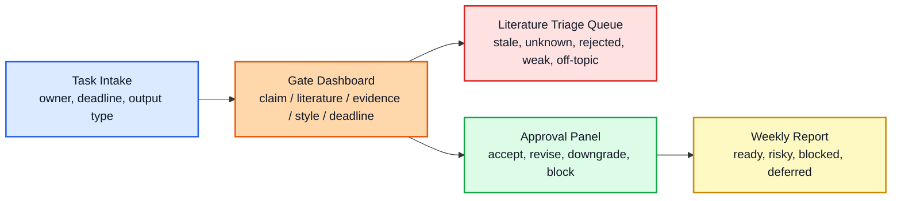

# Interface Blueprint

This workflow needs an interface because the target user should not have to run scripts or inspect CSV files to understand project state. The interface should expose the workflow decisions: what was drafted, what was checked, what failed, who needs to approve it, and what can still ship by the deadline.

## MVP Screen

## Panels

| Panel | User question | Data source |
| --- | --- | --- |
| Task Intake | What needs to be produced, by whom, and by when? | `data/sample_research_tasks.csv` |
| Agent Output Review | What did the agent produce, and does it need human review? | `data/sample_agent_outputs.csv` |
| Claim Gate | Which claims are approved, provisional, blocked, or too strong? | `data/sample_claim_ledger.csv` |
| Literature Triage | Which search hits are stale, unaccepted, rejected, weak, or off-topic? | `data/sample_evidence_ledger.csv` |
| Approval Panel | What decision should the human owner make now? | task + claim + evidence ledgers |
| Weekly Report | What can ship, what is risky, and what is deferred? | `reports/sample_weekly_report.md` |

## M365 Version

For a Bosch-style Microsoft 365 workflow, the interface can be:

- SharePoint or Excel table as the structured task/evidence store.
- Power Apps form for task intake and approval decisions.
- Power Automate flow for reminders, approvals, escalations, and report generation.
- Power BI dashboard for status, blockers, and source-quality risk.

## GitHub Demo Version

For this repository, the same interface can start smaller:

- Static HTML dashboard for visual walkthrough.
- Streamlit app for interactive filtering.
- CLI report for reproducible audit output.

The important point is that the interface should not hide the gates. It should make the gates visible.
