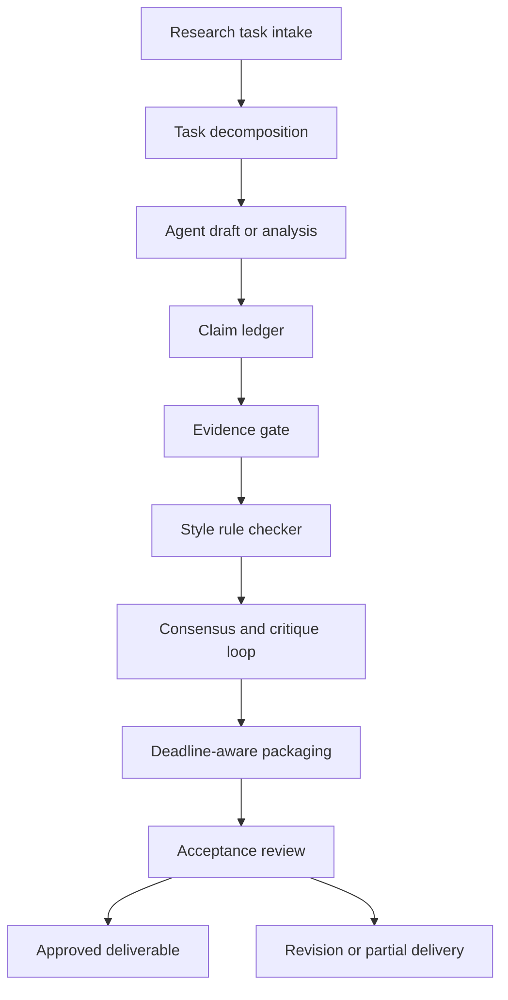

# Research-Agent Quality Control Design

Research-agent workflows need explicit quality control because agents are useful language and analysis workers, not reliable process owners. They can summarize, classify, draft, and critique, but they can also overstate uncertain findings, mix evidence levels, drift into persuasive wording, or miss a deadline because the due date was outside the immediate prompt context.

This design treats quality control as a workflow layer around the agent. The agent can propose outputs, but each output must pass through structured checks before it becomes a deliverable, a report claim, or a status update. The goal is not to slow the process with ceremony. The goal is to make research work reproducible enough that a reviewer can understand what was claimed, what evidence supported it, what was rejected, and what still needs attention.

## Design Goals

- Keep agent outputs bounded to specific research tasks.
- Separate drafted claims from accepted claims.
- Require traceable evidence for claims that affect decisions.
- Detect unsupported certainty, weak evidence, and rhetorical drift.
- Use multiple agents or reviewers for critique without creating circular agreement.
- Track time, deadlines, and partial delivery decisions explicitly.
- Decompose broad research requests into testable subdeliverables.
- Define acceptance criteria before a deliverable is marked complete.

## Why Agents Need Skills and Checklists

Agents perform better when a task includes procedural memory: what to check, what to avoid, and what a finished artifact should contain. A skill is a reusable operating guide for a task family, such as literature triage, experiment summary, evidence extraction, or weekly reporting. A checklist is the execution-time gate that confirms the skill was applied.

Skills should encode stable research practices:

- How to distinguish observation, inference, and recommendation.
- What evidence types are acceptable for each claim type.
- What fields must be captured before a task can move forward.
- Which wording patterns indicate overclaiming.
- When human review is mandatory.
- How to report uncertainty without burying the conclusion.

Checklists should be short enough to run every time. A checklist that is too broad becomes decorative and will be skipped under deadline pressure. Each checklist item should be phrased as a verifiable condition, not as advice.

Example checklist items:

| Check | Pass condition |
| --- | --- |
| Claim traceability | Every material claim has a claim ledger entry. |
| Evidence sufficiency | Each accepted claim has at least one approved evidence record. |
| Uncertainty handling | Limits, assumptions, and unresolved questions are visible. |
| Style compliance | The style checker reports no high-severity rhetorical drift. |
| Deadline state | The task has a current due date, timebox, and delivery mode. |
| Acceptance criteria | The deliverable meets the criteria defined before drafting. |

## Core Workflow

The workflow does not assume the agent's first output is wrong. It assumes the first output is provisional. Quality control converts provisional output into an auditable deliverable.

## Task Decomposition

Large research requests should be split into smaller work units before any agent drafts a final answer. Decomposition reduces ambiguity and makes quality checks enforceable.

Each subtask should include:

- `task_id`: Stable identifier.
- `parent_task_id`: Link to the broader request.
- `objective`: Specific question or artifact to produce.
- `inputs`: Sources, datasets, notes, or constraints available to the agent.
- `expected_output`: Summary, table, recommendation, critique, extraction, or report section.
- `risk_level`: Low, medium, or high based on decision impact.
- `review_required`: Whether human or multi-agent review is mandatory.
- `due_at`: Deadline for the subtask.
- `acceptance_criteria`: Conditions that define completion.

Decomposition should stop when the subtask can be reviewed independently. For example, "prepare the study update" is too broad. Better subtasks are "extract claims from experiment notes," "verify evidence for the reported result," "draft the result summary," and "review the summary for unsupported causal language."

## Claim Ledger

The claim ledger is the central control for overclaiming. It records every material claim before the claim is allowed into the final deliverable.

Recommended fields:

| Field | Purpose |
| --- | --- |
| `claim_id` | Stable identifier for review and revision. |
| `task_id` | Link to the research task. |
| `claim_text` | The claim as drafted. |
| `claim_type` | Observation, inference, comparison, recommendation, forecast, or limitation. |
| `scope` | Population, dataset, method, time period, or context covered by the claim. |
| `confidence` | Low, medium, or high based on evidence quality. |
| `evidence_ids` | Evidence records supporting the claim. |
| `assumptions` | Conditions required for the claim to hold. |
| `review_status` | Draft, needs evidence, accepted, revised, rejected, or deferred. |
| `owner` | Agent or human responsible for resolving the claim. |

The ledger forces a useful distinction: a statement can be well written and still not be accepted. Claims should not be approved merely because they sound plausible or align with the expected conclusion.

## Controlling Overclaiming

Overclaiming occurs when the wording is stronger than the evidence. The control mechanism is a combination of claim typing, scope limits, confidence labels, and rewrite rules.

High-risk patterns:

- Causal claims from correlational evidence.
- General claims from a narrow sample.
- Performance claims without baseline, metric, or evaluation context.
- Claims about user behavior without observed user data.
- "Fully automated" claims when human approval remains part of the workflow.
- Recommendations that omit uncertainty, cost, or implementation limits.

Rewrite rules:

| Risky wording | Safer control |
| --- | --- |
| "proves" | Use "suggests" unless proof criteria are defined and met. |
| "eliminates the need for review" | State which review step is reduced, preserved, or escalated. |
| "works across research teams" | Specify the tested setting or intended operating context. |
| "the best approach" | Compare against named alternatives and criteria. |
| "autonomous" | Clarify which decisions remain human-owned. |

The claim ledger should reject or downgrade claims whose wording exceeds the accepted evidence scope.

## Evidence Gate

The evidence gate decides whether a claim can move from drafted to accepted. Evidence should be evaluated before rhetorical polish, because fluent language can hide weak support.

Evidence records should include:

- `evidence_id`: Stable identifier.
- `source_type`: Dataset, experiment output, document, meeting note, external source, expert review, or workflow log.
- `source_location`: File path, record ID, URL, or tracker reference.
- `recency`: Date the evidence was generated or last verified.
- `relevance`: Direct, indirect, background, or contradictory.
- `quality`: Strong, acceptable, weak, or unusable.
- `limitations`: Known gaps, missing context, or validity concerns.
- `reviewer`: Agent or human that assessed the evidence.

Evidence gate rules:

| Claim type | Minimum evidence |
| --- | --- |
| Observation | Direct source record or reproducible output. |
| Inference | Observation plus stated reasoning and assumptions. |
| Comparison | Comparable baseline, metric, and evaluation context. |
| Recommendation | Evidence, constraints, alternatives, and risk tradeoffs. |
| Forecast | Explicit assumptions, uncertainty range, and review date. |
| Limitation | Source, observed failure, or missing evidence record. |

If evidence is weak but the information is still useful, the output should label the statement as provisional and keep it out of decision-critical sections.

## Rhetorical Pattern Drift

Rhetorical pattern drift happens when an agent gradually shifts from technical reporting into sales language, excessive certainty, or a house style that hides uncertainty. It is especially risky in research coordination because a polished report can make incomplete work look finished.

A style rule checker should scan for:

- Unsupported certainty markers: "definitively," "guarantees," "proves," "eliminates."
- Recruiting or promotional language: "game-changing," "transformative," "world-class," "seamless."
- Vague scale claims: "significantly improves" without a metric.
- Hidden agency: passive phrasing that obscures who reviewed or approved a result.
- Missing uncertainty markers where confidence is low or medium.
- Repeated narrative templates that make unrelated results sound equivalent.

The checker should produce structured findings:

| Field | Purpose |
| --- | --- |
| `finding_id` | Stable issue identifier. |
| `text_span` | Phrase or sentence flagged. |
| `rule_id` | Style or rhetoric rule violated. |
| `severity` | Low, medium, or high. |
| `recommended_action` | Rewrite, add evidence, downgrade confidence, or remove. |
| `resolved_by` | Agent or human that handled the finding. |

Style checks should not flatten every document into the same voice. They should protect technical accuracy, visible uncertainty, and reviewer accountability.

## Multi-Agent Consensus and Critique Loops

Multi-agent workflows are useful when agents are assigned different roles rather than asked to agree with each other. Consensus should mean "independent checks converged under a shared rubric," not "several agents produced similar confident text."

Recommended roles:

- Drafting agent: Produces the first structured output.
- Evidence reviewer: Checks evidence coverage and source quality.
- Skeptical reviewer: Looks for overclaiming, missing assumptions, and unsupported leaps.
- Style reviewer: Checks rhetorical drift and deliverable clarity.
- Integrator: Merges accepted changes and records unresolved issues.

Reviewer rotation prevents a single agent style from becoming the default judge of quality. Rotation also reduces the risk that the same failure pattern appears in both the draft and the review.

Rotation rules:

- The drafting agent cannot approve its own claims.
- The evidence reviewer and style reviewer should rotate by task or reporting cycle.
- High-risk claims require at least one skeptical review.
- Disagreement should be captured as a review record, not erased during synthesis.
- If reviewers disagree on evidence sufficiency, the claim remains provisional until resolved.

Consensus record fields:

| Field | Purpose |
| --- | --- |
| `review_round` | Iteration number. |
| `reviewer_role` | Draft, evidence, skeptical, style, or integration. |
| `decision` | Accept, revise, reject, defer, or escalate. |
| `rationale` | Short explanation tied to the rubric. |
| `affected_claim_ids` | Claims changed by the review. |
| `unresolved_items` | Issues carried into the next round or human review. |

The loop should be bounded. Endless critique is not quality control; it is a delivery risk.

## Deadline-Aware Delivery

Research workflows often need useful partial outputs before perfect outputs. Deadline-aware delivery makes that tradeoff explicit.

Each task should track:

- `due_at`: Final deadline.
- `timebox_minutes`: Maximum agent or review time for the current cycle.
- `remaining_time`: Computed from the current timestamp and due date.
- `delivery_mode`: Full, partial, risk summary, or blocked.
- `minimum_deliverable`: The smallest useful output by the deadline.
- `deferred_items`: Work intentionally left for later.
- `escalation_owner`: Person responsible when quality gates cannot pass in time.

Deadline rules:

| Condition | Workflow behavior |
| --- | --- |
| Plenty of time remains | Run full decomposition, evidence gate, critique loop, and acceptance review. |
| Timebox is nearly exhausted | Stop adding new claims and focus on verifying the most important existing claims. |
| Deadline is close | Deliver a partial output with explicit gaps and deferred items. |
| Evidence gate fails | Report the blocker instead of converting unsupported text into a final claim. |
| Human review is required but unavailable | Mark the output as pending review and exclude it from final decision sections. |

The system should prefer a smaller truthful deliverable over a larger uncertain one.

## Deliverable Acceptance Criteria

Acceptance criteria should be defined before drafting. They create a stable target for both agents and reviewers.

A deliverable is acceptable when:

- The requested artifact type is present and complete.
- All material claims appear in the claim ledger.
- Accepted claims have evidence that passes the evidence gate.
- Rejected or deferred claims are not presented as final.
- Rhetorical drift findings above the allowed severity threshold are resolved.
- Required reviewers have recorded decisions.
- Deadline state is current and any partial-delivery status is visible.
- Open risks, assumptions, and unresolved questions are listed.
- The final output can be traced back to task, evidence, and review records.

Acceptance should be a binary workflow decision, but the deliverable status can be more nuanced:

| Status | Meaning |
| --- | --- |
| `accepted` | Meets all criteria for its intended use. |
| `accepted_with_limits` | Useful, but scope limits must remain visible. |
| `partial` | Meets the minimum deliverable, with deferred items recorded. |
| `needs_revision` | Quality gates found fixable issues. |
| `blocked` | Required evidence, review, or input is unavailable. |
| `rejected` | Output is not suitable for the task. |

## Audit Trail

The workflow should keep enough records to reconstruct how a deliverable was produced:

- Task decomposition records.
- Agent prompts or prompt templates used for the task.
- Claim ledger entries.
- Evidence records and gate decisions.
- Style checker findings.
- Reviewer decisions and disagreements.
- Deadline state changes.
- Acceptance review result.
- Final deliverable version.

The audit trail does not need to store every token of intermediate reasoning. It should store the operational facts needed to answer: what was asked, what was claimed, what supported it, who or what reviewed it, what changed, and why the final status was accepted.

## Failure Modes and Controls

| Failure mode | Control |
| --- | --- |
| Agent produces confident but unsupported text | Require claim ledger entry and evidence gate approval. |
| Weak evidence is treated as decisive | Label evidence quality and downgrade claim confidence. |
| Review agents agree too easily | Use role-specific rubrics and reviewer rotation. |
| Style becomes promotional | Run rhetorical pattern checks before acceptance. |
| Important work misses the deadline | Track timebox and deadline state inside the workflow. |
| Broad task produces vague output | Decompose into independent subtasks with acceptance criteria. |
| Partial output looks final | Use explicit delivery mode and visible deferred items. |
| Human approval is bypassed | Separate review status from draft generation and block final acceptance. |

## Implementation Sequence

1. Add claim ledger and evidence record schemas to the tracker or reporting store.
2. Define checklist templates for common research-agent tasks.
3. Add the evidence gate before report inclusion.
4. Add a style rule checker for certainty, scope, and promotional drift.
5. Introduce reviewer roles and rotation rules for high-risk tasks.
6. Add timebox and deadline state to each task.
7. Require deliverable acceptance criteria at task creation.
8. Generate an audit record whenever a claim changes status.
9. Report accepted, partial, blocked, and deferred work separately.

This workflow keeps agents useful without treating fluent output as finished research. Quality comes from bounded tasks, explicit evidence, visible uncertainty, independent critique, and deadline-aware delivery decisions.
