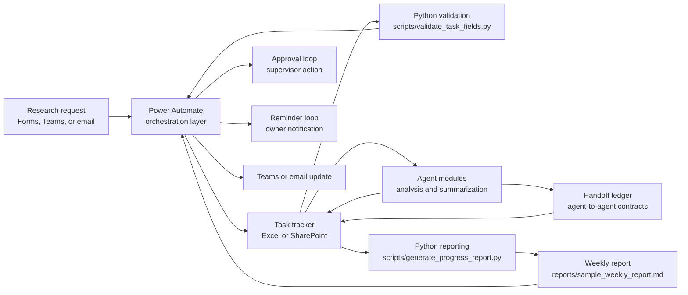

# Solution Architecture

This project models a research workflow where Microsoft 365 automation provides process control and Python or agent modules provide task-specific analysis, validation, and reporting support. The main design choice is to keep durable workflow state outside of the agents. Agents can produce useful outputs, but the system of record remains the task tracker and the orchestration layer that updates it.

## Architecture Overview



The orchestration layer is responsible for knowing what should happen next. Agent modules are responsible for producing bounded artifacts, such as summaries, checks, recommendations, or report sections. This separation prevents agent output from becoming an implicit workflow state machine.

## Orchestration Layer vs. Agent Modules

### Orchestration Layer

The orchestration layer should be implemented in Power Automate because it owns event-driven coordination across Microsoft 365 systems:

- Accept new research requests from Forms, Teams, or email.
- Normalize request fields into a task record.
- Create or update the shared tracker in Excel or SharePoint.
- Route supervisor approvals when `approval_needed` is `yes`.
- Send owner notifications and deadline reminders.
- Maintain workflow execution logs, timestamps, and retry status.
- Decide whether a task can move to reporting, needs approval, or is blocked.

Power Automate should not perform complex analysis or long-running data processing. Its job is to move records through a controlled workflow and keep humans informed at the right moments.

### Agent Modules

Agent modules should be treated as stateless or lightly stateful workers. They receive a task context, produce a structured result, and write that result back through the tracker or a controlled output channel.

Example agent module responsibilities:

- Summarize task updates from notes or messages.
- Extract blockers and next actions.
- Draft weekly progress report sections.
- Check whether an analysis output needs human review.
- Convert raw research output into tracker-ready fields.

The sample `data/sample_agent_outputs.csv` represents this boundary. Each output is tied to a `task_id`, an `agent_name`, an `output_type`, a short `summary`, and a `needs_human_review` flag. The agent does not independently close the task or approve its own output; those decisions remain part of the workflow.

The multi-agent boundary is now represented by two additional ledgers:

- `data/sample_agent_roles.csv`: role registry for each agent, including delegation rights, required input, required output, and approval boundary.
- `data/sample_handoff_ledger.csv`: typed handoff events between agents, including preconditions, acceptance checks, status, and delivery impact.

This follows the same state-control principle as the rest of the architecture. Agent-to-agent communication is allowed, but it is recorded as a workflow event rather than treated as hidden conversation history.

## Task State Model

The task tracker is the system of record. In the demo, `data/sample_research_tasks.csv` contains the core state:

| Field | Purpose |
| --- | --- |
| `task_id` | Stable identifier used to join task records, agent outputs, approvals, reminders, and reports. |
| `project_name` | Research project or workstream. |
| `task_title` | Human-readable task description. |
| `owner` | Person responsible for follow-up. |
| `due_date` | Date used by reminder and reporting logic. |
| `status` | Current execution state, such as `not_started`, `in_progress`, or `done`. |
| `approval_needed` | Boolean-style routing flag, represented as `yes` or `no`. |
| `approval_status` | Approval state, such as `pending`, `approved`, or `not_required`. |
| `priority` | Sorting and escalation signal. |
| `blocker` | Open issue preventing progress. |

The current demo keeps the state model intentionally small. A production version should add fields such as `created_at`, `updated_at`, `last_reminder_at`, `reminder_count`, `last_agent_run_at`, `agent_review_status`, `workflow_run_id`, and `source_channel`.

### State Transitions

At a high level, a task moves through the following states:

```text
new request
  -> validated
  -> tracked
  -> approval_pending, if approval_needed = yes
  -> approved or rejected
  -> assigned
  -> in_progress
  -> blocked, if blocker is present
  -> ready_for_reporting
  -> done
```

The demo uses `status` and `approval_status` rather than a single combined state field. This is useful because approval and execution can be reasoned about separately. For example, a task can be `in_progress` while its reporting claim is still waiting for approval.

## Approval Loop

The approval loop protects tasks that require supervisor confirmation before downstream reporting or claims are finalized.

Flow behavior:

1. Power Automate reads the task record.
2. If `approval_needed` is `yes`, it creates an approval request.
3. The supervisor approves, rejects, or requests changes.
4. Power Automate writes the result to `approval_status`.
5. The task owner is notified.
6. Reporting logic treats non-approved approval-required tasks as pending.

The Python validation script enforces part of this contract. `scripts/validate_task_fields.py` flags rows where `approval_needed` is `yes` but `approval_status` is empty or `not_required`. In a production workflow, the same validation should run before a new task is accepted and again before weekly reporting.

## Reminder Loop

The reminder loop is time-based rather than event-based. It exists because research tasks often fail silently when the only signal is a spreadsheet row.

Flow behavior:

1. A scheduled Power Automate flow runs daily.
2. It reads open tasks from the tracker.
3. It filters tasks where `status` is not `done`.
4. It compares `due_date` with the current date.
5. If the task is due within the reminder window, it sends a Teams or email reminder to the owner.
6. It updates reminder metadata, such as `reminder_count` and `last_reminder_at`.

The sample reminder rule is: send a reminder when an open task is due within three days. The demo report generator applies the same rule for the `Deadline Reminders` section. In production, this should be parameterized so urgent tasks, high-priority tasks, and blocked tasks can use different reminder windows.

## Reporting Loop

Reporting is a scheduled aggregation over task state and agent outputs. It should be reproducible from the tracker, not assembled manually from message history.

Current reporting behavior:

- `scripts/generate_progress_report.py` reads `data/sample_research_tasks.csv`.
- It joins task-linked agent outputs from `data/sample_agent_outputs.csv`.
- It summarizes tasks by `status`.
- It summarizes task volume by `owner`.
- It lists approval-required tasks that are not yet approved.
- It lists open tasks due within three days.
- It lists agent outputs that still need human review.
- It lists recorded blockers.
- It writes `reports/sample_weekly_report.md`.

In a production version, Power Automate would trigger the reporting run on a weekly schedule or after a reporting queue is marked ready. Python would generate the report body, and Power Automate would distribute the result through Teams or email. Agent modules could draft narrative summaries, but the final report should still be grounded in the tracker fields.

## Failure Modes and Controls

| Failure mode | Likely cause | Control |
| --- | --- | --- |
| Missing required fields | Incomplete Forms submission, email parsing error, manual tracker edit | Run field validation before task creation and before reporting. |
| Approval task never resolved | Supervisor does not respond or approval request is lost | Add approval timeout, escalation owner, and reminder on pending approval. |
| Duplicate task records | Same request submitted through multiple channels | Use deterministic identifiers where possible and check similar open tasks before insert. |
| Reminder spam | Scheduled flow sends repeated reminders without cooldown | Track `last_reminder_at` and `reminder_count`; suppress reminders after a threshold or escalate. |
| Stale agent output | Agent summary generated before latest tracker update | Store `last_agent_run_at` and compare it with `updated_at`. |
| Report includes unapproved claims | Reporting script reads task text without checking approval state | Filter or label tasks where `approval_needed` is `yes` and `approval_status` is not `approved`. |
| Date parsing failure | Inconsistent date formats across channels | Normalize dates at intake and validate ISO `YYYY-MM-DD` format. |
| Lost workflow execution context | Flow succeeds partially but tracker update fails | Record `workflow_run_id`, step status, and retry result in an audit log. |
| Human review bypassed | Agent output marked final without review | Require `needs_human_review` and review status before report inclusion. |
| Agent ownership ambiguity | Multiple agents produce related outputs without clear responsibility | Maintain an agent role registry and handoff ledger with explicit sender, receiver, artifact, and acceptance checks. |
| Self-approval loop | Drafting or reviewer agent accepts its own output | Validate role boundaries and require final delivery approval from `human_owner`. |

## Power Automate vs. Python

### Implement in Power Automate

Power Automate should own workflow operations that depend on Microsoft 365 triggers, approvals, notifications, and shared business state:

- Intake triggers from Forms, Teams, and email.
- Tracker row creation and update.
- Supervisor approval requests.
- Owner notifications.
- Deadline reminder scheduling.
- Escalation for overdue tasks or pending approvals.
- Weekly report distribution.
- Audit logging for workflow runs.

### Implement in Python

Python should own deterministic data processing and report generation:

- Required field validation.
- Date parsing and reminder eligibility checks.
- Tracker quality checks before reporting.
- Aggregation by owner, status, approval state, and blockers.
- Markdown report generation.
- Optional integration wrappers for agent outputs.

The existing scripts already follow this split:

- `scripts/validate_task_fields.py` validates required fields and approval consistency.
- `scripts/generate_progress_report.py` builds a reproducible Markdown report from task records.

### Implement in Agent Modules

Agent modules should be used where language understanding or research summarization adds value:

- Extracting blockers from unstructured notes.
- Summarizing progress updates.
- Drafting narrative sections for reports.
- Suggesting next actions for blocked tasks.
- Reviewing whether an output needs human confirmation.

Agent outputs should be written back as structured records and reviewed by the workflow. They should not directly mutate approval state, suppress reminders, or mark tasks complete without a controlled handoff.

## Implementation Sequence

1. Define the tracker schema in Excel or SharePoint using the fields from `data/sample_research_tasks.csv`.
2. Build the intake flow in Power Automate and write validated requests to the tracker.
3. Add the approval flow for tasks where `approval_needed` is `yes`.
4. Add the daily reminder flow for open tasks near their due date.
5. Run Python validation before accepting tracker rows into the reporting queue.
6. Run Python reporting on a weekly schedule.
7. Add agent modules for summarization and blocker extraction.
8. Add review gates so agent output is included in reports only after required human review.
9. Add audit fields and failure handling for retries, stale records, and unresolved approvals.

This architecture keeps the workflow accountable while still allowing agent modules to improve the quality and speed of research coordination.
