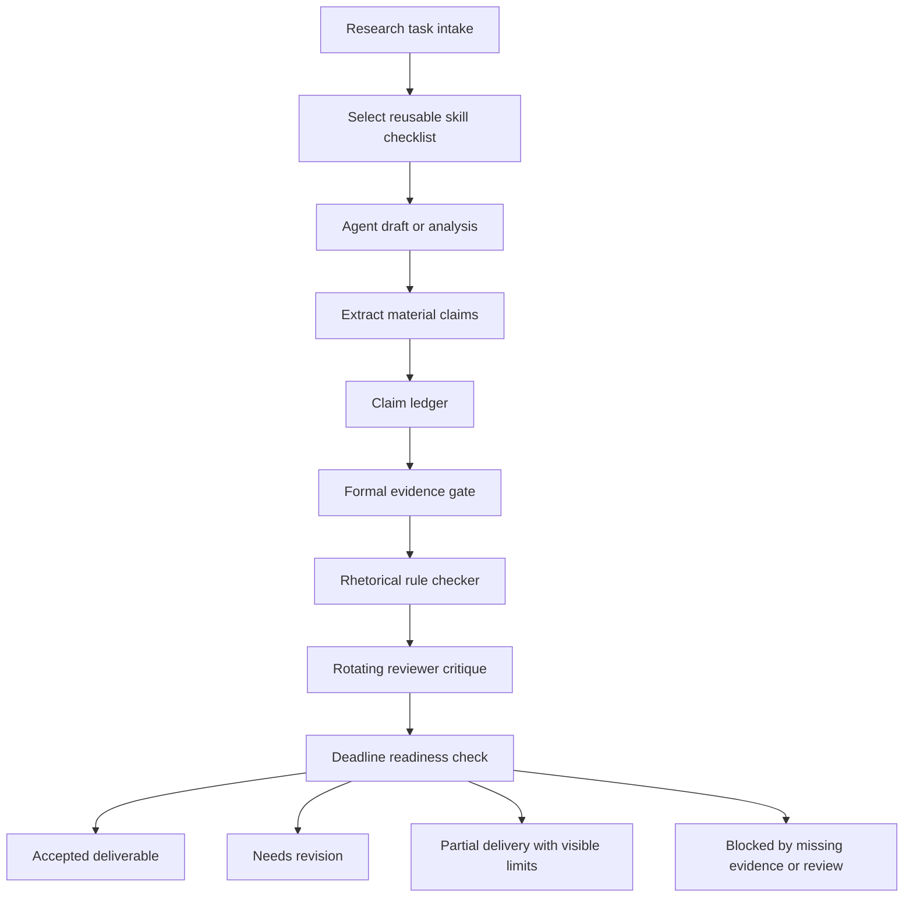

# To-Be Process

The proposed process wraps agent outputs in a quality-control workflow. The agent still drafts and analyzes, but the workflow decides whether the output is accepted, revised, partially delivered, or blocked.

## Expected Improvements

- Repeated research expectations become explicit skill gates.
- Claims are reviewed before entering final reports.
- Evidence quality is visible rather than implied by fluent prose.
- Weak rhetorical patterns are flagged and rewritten with scope and mechanism.
- Reviewer roles are separated to reduce single-agent aesthetic drift.
- Deadline state determines when to stop iterating and package a useful artifact.

