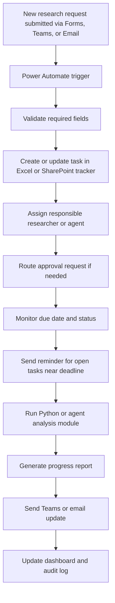

# To-Be Process

The proposed process uses Microsoft 365 workflow automation as the coordination layer. Power Automate handles triggers, validation, routing, reminders, and tracker updates. Python or AI-agent modules can then support analysis and reporting.

## Expected Improvements

- More transparent task ownership
- Faster approval routing
- Better deadline awareness
- Standardized progress reporting
- Clearer integration between agent outputs and project workflow

